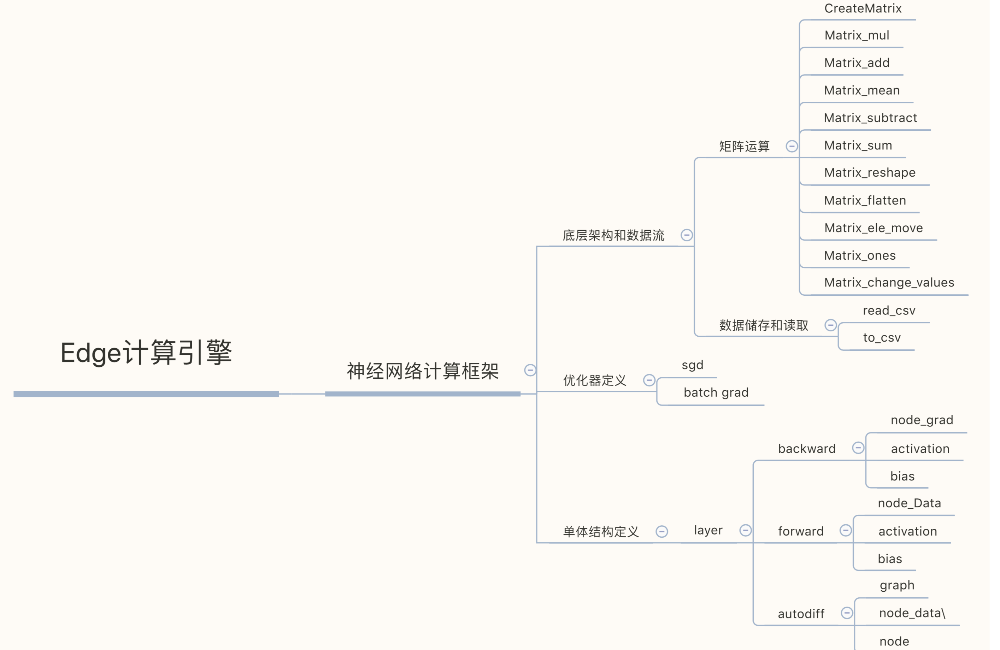

<!-- <div align=center></div> -->
<div align=center></div>

<div align=center><h1>Edge-Engine</h1></div>
<div align=center>一个开源的科学计算引擎


Email: zk@likedge.top

[](https://support.apple.com/downloads/macos)
[](https://ubuntu.com/download/server)
[](https://github.com/AllenZYJ/Edge-Computing-Engine/actions)
[](https://raw.githubusercontent.com/tesseract-ocr/tesseract/master/LICENSE)


</div>


------


> 项目开始日期 : 2019/10/01
>
> 测试 : main.cpp | nerual_network.cpp | 
>
> 2022年11月29日14:56:59：卷积层和bn层的批量前向
>
> 2022年11月19日12:28:29：实现卷积神经网络单元前向传播
>
> 2019年10月01日12:28:56：新增全连接神经网络架构(新增全连接网络正向传播和反向传播的测试demo)
>
> 测试环境:
>
> MacBook Pro、ubuntu
>
> 编译器环境:
>
> macos:
> Configured with: --prefix=/Applications/Xcode.app/Contents/Developer/usr --with-gxx-include-dir=/Applications/Xcode.app/Contents/Developer/Platforms/MacOSX.platform/Developer/SDKs/MacOSX10.14.sdk/usr/include/c++/4.2.1
> Apple LLVM version 10.0.1 (clang-1001.0.46.4)
> Target: x86_64-apple-darwin18.7.0
> Thread model: posix
> version
> ubuntu:
> g++ (Ubuntu 9.4.0-1ubuntu1~20.04.1) 9.4.0
> Copyright (C) 2019 Free Software Foundation, Inc.
> This is free software; see the source for copying conditions.  There is NO
> warranty; not even for MERCHANTABILITY or FITNESS FOR A PARTICULAR PURPOSE.


------

这是什么?



## Quickstart

```
git clone git@github.com:AllenZYJ/Edge-Computing-Engine.git

cd to install_diff
```

cd install_diff

run on terminal

```
make
make install
```

```shell
g++ main.cpp -o main -lautodiff
```

run

```shell
./main
```

### Define network

```c
Matrix data_mine = CreateRandMat(2,1);
Matrix label = CreateMatrix(2,1);
Matrix weight1 = CreateRandMat(2,2);
Matrix weight2 = CreateRandMat(2,2);
Matrix weight3 = CreateRandMat(2,2);
Matrix weight4 = CreateRandMat(2,2);
for(int epoch = 0;epoch<20;epoch++)
{
cout_mat(weight1);
edge_network sequaltial(2,2);

Matrix output1 = sequaltial.forward(data_mine,weight1);
Matrix output2 = sequaltial.forward(output1,weight2);
Matrix output3 = sequaltial.forward(output2,weight3);
Matrix output4 = sequaltial.forward(output3,weight4);
Matrix output_end = sequaltial.end_layer_backward(label,output4);
//get the forward
Matrix backward1 = sequaltial.backward(output_end,output3,weight4);
Matrix grad_w1w2 = mul_simple(backward1,data_mine);
Matrix backward2 = sequaltial.backward(backward1,output2,weight3);
Matrix grad_w3w4 = mul_simple(backward2,data_mine);
Matrix backward3 = sequaltial.backward(backward2,output1,weight2);
Matrix grad_w5w6 = mul_simple(backward3,data_mine);
Matrix backward4 = sequaltial.backward(backward3,output4,weight1);
Matrix grad_w7w8 = mul_simple(backward4,data_mine);
weight1 = subtract(weight1,times_mat(0.0001,padding(grad_w1w2,2,2)));
weight2 = subtract(weight2,times_mat(0.0001,padding(grad_w3w4,2,2)));
weight3 = subtract(weight3,times_mat(0.0001,padding(grad_w5w6,2,2)));
weight4 = subtract(weight4,times_mat(0.0001,padding(grad_w7w8,2,2)));
}
```
```shell
Output:
---------epoch: 0------------
loss: 4.65667
loss: 3.28273
---------epoch: 1------------
loss: 4.65655
loss: 3.28265
---------epoch: 2------------
loss: 4.65643
loss: 3.28257
---------epoch: 3------------
loss: 4.65631
loss: 3.28249
---------epoch: 4------------
loss: 4.65619
loss: 3.2824
---------epoch: 5------------
loss: 4.65607
loss: 3.28232
---------epoch: 6------------
loss: 4.65596
loss: 3.28224
---------epoch: 7------------
loss: 4.65584
loss: 3.28216
---------epoch: 8------------
loss: 4.65572
loss: 3.28208
---------epoch: 9------------
loss: 4.6556
loss: 3.282
---------epoch: 10------------
loss: 4.65548
loss: 3.28192
---------epoch: 11------------
loss: 4.65536
loss: 3.28184
---------epoch: 12------------
loss: 4.65524
loss: 3.28176
---------epoch: 13------------
loss: 4.65512
loss: 3.28168
---------epoch: 14------------
loss: 4.65501
loss: 3.2816
---------epoch: 15------------
loss: 4.65489
loss: 3.28152
---------epoch: 16------------
loss: 4.65477
loss: 3.28144
---------epoch: 17------------
loss: 4.65465
loss: 3.28136
---------epoch: 18------------
loss: 4.65453
loss: 3.28128
---------epoch: 19------------
loss: 4.65441
loss: 3.2812
```

### API:

- [x] Matrix read_csv(string &file_path)读取格式化文件(csv),返回一个自动计算长度的矩阵.

- [x] 实现格式化文件写入接口.比较pandas.to_csv.

- [x] 矩阵广播机制,实现padding接口

- [x] 全连接层前向传播和反向传播接口,支持自动求导

- [x] 矩阵微分和自动求导接口封装

- [x] int save_txt(Matrix mid1,string path = "./",string delimiter = ",",string header="./") 设计文件流获取文件头部接口 , 写入格式化文件 , 已设计支持矩阵类型数据写入,支持自定义表头,写入文件路径 , 自定义分隔符,默认为" , ".

- [x] Create a matrix :  create(row,cols)开辟一个矩阵结构的内存,元素初值为0;

- [x] Change the element for matrix void move_ele(int &ele1, int &ele2),修改某一个位置的元素的值.

- [x] Matrix1+Matrix2 : Matrix add(Matrix mid1,Matrix mid2,int flag=1),矩阵加和操作接口,可选位运算加速.

- [x] Flag is how to compete the ele ,default 1 ,bitwise operation(位运算加速).

- [x] Matrix1-Matrix2 : Matrix subtract(Matrix mid1,Matrix mid2)

- [x] Matrix1*Matrix2 : Matrix mul(Matrix mid1,Matrix mid2)

- [x] Matrix1*n : Matrix times_mat(int times,Matrix mid1)

- [x] Matrix1's Transposition : Matrix get_T(Matrix mid1)矩阵转置

- [x] Mul(matrix1,matrix2)矩阵乘积(完整数学定义).

- [x] double* flatten(Matrix mid1) : Return a flattened array.矩阵展开

- [x] Matrix matrix_rs(Matrix mid1,int rs_row,int rs_col) 矩阵的结构压缩

- [x] double matrix_sum(Matrix mid1)矩阵求和

- [x] double matrix_mean(Matrix mid1)均值

- [x] Matrix appply(Matrix mid1,Matrix mid2,int axis = 0)矩阵拼接

- [x] Matrix iloc(Matrix mid1,int start_x=0,int end_x=0,int start_y=0,int end_y=0)矩阵切片

- [x] Matrix mul_simple(Matrix mid1,Matrix mid2)为了贴合机器学习的需要,实现了矩阵对应元素相乘,请与传统意义的矩阵乘法区分开.

- [x] Relu激活函数矩阵接口

- [x] 均方误差矩阵接口

- [x] 创建随机权重矩阵接口

- [x] 卷积神经网络定义(包括但不限于卷积核,池化层定义,自定义损失接口).

  ### 即将着手开发:

- [ ] 主流网络架构实现.

  ### Something :

> 1. 矩阵元素默认为1
> 2. 使用位运算加速防止填充过大的数值,但是会损失一定精度,慎用.
> 3. 记得delete(matrix)在你使用完一个矩阵计算单元以后.
> 4. api接口更多的接近于pandas和numpy的使用习惯.
> 5. 更多的细节参见目前最新的代码
> 

------


<div align = center></div>


 个人小站:[极度空间](http://likedge.top/)

作者邮箱:zk@likedge.top | edge@ibooker.org.cn

 QQ:2533524298
