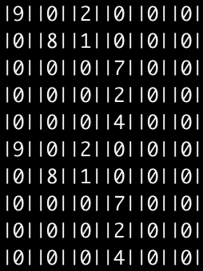
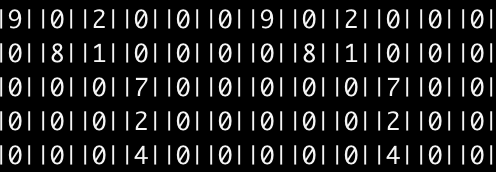

Edge-Computing-Engine

Edge : 一个开源的科学计算引擎

[](https://github.com/AllenZYJ/Edge-Computing-Engine/blob/add-license-1/LICENSE)

目前实现的:

更新11.20 

00:06:更新apply接口:

定义原型:

​	Matrix appply(Matrix mid1,Matrix mid2,int axis = 0)	

axis=0 :



axis = 1:

0.268941
|9||0||2||0||0||0|🏃
|0||8||1||0||0||0|🏃
|0||0||0||7||0||0|🏃
|0||0||0||2||0||0|🏃
|0||0||0||4||0||0|🏃
|9||0||2||0||0||0|🏃
|0||8||1||0||0||0|🏃
|0||0||0||7||0||0|🏃
|0||0||0||2||0||0|🏃
|0||0||0||4||0||0|🏃




------

更新11.18

------

 00:12

- [x] CSV,dat,txt等格式化文件读取:

  实现由文件流读取内存文件首地址:

  接口为:

  Matrix read_csv(string &file_path)

  使用eof标志位表示文件末尾

  默认为double精度的数据读取

  返回一个shape为文件rows和cols的matrix.

  例如:

  

- [x] Csv,txt,dat,等格式化文件流读取,转化为矩阵,获取尺寸.

- [x] 矩阵运算部分：

  使用案例:

```c
	welcome();
	Matrix a = CreateMatrix(5,6);
	cout<<"end"<<endl;
	change_va(a,1,2,1);
	change_va(a,2,3,7);
	change_va(a,3,3,2);
	change_va(a,4,3,4);
	change_va(a,0,0,9);
	change_va(a,0,2,2);
	change_va(a,1,1,8);
	start = clock();
	cout<<"matrix sum: "<<matrix_sum(a)<<endl;
	cout<<"matrix mean: "<<matrix_mean(a)<<endl;
	cout<<"matrix T: "<<endl;
	Matrix b = get_T(a);
	for(int index_x = 0;index_x<b.row;index_x++)
	{
		for(int index_y=0;index_y<b.col;index_y++)
		{
			cout<<b.matrix[index_x][index_y]<<" ";
		}
		cout<<endl;
	}
	cout<<"-----------split line-----------"<<endl;
	cout<<"matrix*n"<<endl;
	Matrix c = times_mat(8,b);
	for(int index_x = 0;index_x<c.row;index_x++)
	{
		for(int index_y=0;index_y<c.col;index_y++)
		{
			cout<<c.matrix[index_x][index_y]<<" ";
		}
		cout<<endl;
	}
	cout<<"-----------split line-----------"<<endl;
	cout<<"matrix*matrix"<<endl; 
	Matrix d =mul(c,get_T(c));
	for(int index_x = 0;index_x<d.row;index_x++)
	{
		for(int index_y=0;index_y<d.col;index_y++)
		{
			cout<<d.matrix[index_x][index_y]<<" ";
		}
		cout<<endl;
	}
	cout<<"-----------split line-----------"<<endl;
	Matrix rs = matrix_rs(a,6,5);
	for(int index_x = 0;index_x<rs.row;index_x++)
	{
		for(int index_y=0;index_y<rs.col;index_y++)
		{
			cout<<rs.matrix[index_x][index_y]<<" ";
		}
		cout<<endl;
	}
	times_mat(5,a);
	stop = clock();
    printf("%f\n", (double)(stop - start) / CLOCKS_PER_SEC);
	return 0;

```
> 矩阵部分API:

- [x] ​		Create a matrix :  create(row,cols)

- [x] ​		Change the element for matrix void move_ele(int &ele1, int &ele2)

- [x] ​		Matrix1+Matrix2 : Matrix add(Matrix mid1,Matrix mid2,int flag=1)

- [x] ​		Flag is how to compete the ele ,default 1 ,bitwise operation(位运算加速).

- [x] ​		Matrix1-Matrix2 : Matrix subtract(Matrix mid1,Matrix mid2)

- [x] ​		Matrix1*Matrix2 : Matrix mul(Matrix mid1,Matrix mid2)

- [x] ​		Matrix1*n : Matrix times_mat(int times,Matrix mid1)

- [x] ​		Matrix1's Transposition : Matrix get_T(Matrix mid1)

- [x] ​		Mul(matrix1,matrix2)

  矩阵**A**：

| 第1列   | 第2列   | 第3列   | 第4列   | 第5列   |
| ------- | ------- | ------- | ------- | ------- |
| 72.0000 | 0.0000  | 0.0000  | 0.0000  | 0.0000  |
| 0.0000  | 64.0000 | 0.0000  | 0.0000  | 0.0000  |
| 16.0000 | 8.0000  | 0.0000  | 0.0000  | 0.0000  |
| 0.0000  | 0.0000  | 56.0000 | 16.0000 | 32.0000 |
| 0.0000  | 0.0000  | 0.0000  | 0.0000  | 0.0000  |
| 0.0000  | 0.0000  | 0.0000  | 0.0000  | 0.0000  |

​	矩阵**B**：

| 第1列   | 第2列   | 第3列   | 第4列   | 第5列  | 第6列  |
| ------- | ------- | ------- | ------- | ------ | ------ |
| 72.0000 | 0.0000  | 16.0000 | 0.0000  | 0.0000 | 0.0000 |
| 0.0000  | 64.0000 | 8.0000  | 0.0000  | 0.0000 | 0.0000 |
| 0.0000  | 0.0000  | 0.0000  | 56.0000 | 0.0000 | 0.0000 |
| 0.0000  | 0.0000  | 0.0000  | 16.0000 | 0.0000 | 0.0000 |
| 0.0000  | 0.0000  | 0.0000  | 32.0000 | 0.0000 | 0.0000 |

​	To

| 第1列     | 第2列     | 第3列     | 第4列     | 第5列  | 第6列  |
| --------- | --------- | --------- | --------- | ------ | ------ |
| 5184.0000 | 0.0000    | 1152.0000 | 0.0000    | 0.0000 | 0.0000 |
| 0.0000    | 4096.0000 | 512.0000  | 0.0000    | 0.0000 | 0.0000 |
| 1152.0000 | 512.0000  | 320.0000  | 0.0000    | 0.0000 | 0.0000 |
| 0.0000    | 0.0000    | 0.0000    | 4416.0000 | 0.0000 | 0.0000 |
| 0.0000    | 0.0000    | 0.0000    | 0.0000    | 0.0000 | 0.0000 |
| 0.0000    | 0.0000    | 0.0000    | 0.0000    | 0.0000 | 0.0000 |

- [x] ​		double* flatten(Matrix mid1)


|  1   |  2   |  3   |
| :--: | :--: | :--: |
|  2   |  4   |  6   |
|  7   |  8   |  9   |

​	To

| 1    | 2    | 3    | 2    | 4    | 6    | 7    | 8    | 9                  |
| ---- | ---- | ---- | ---- | ---- | ---- | ---- | ---- | :----------------- |
|      |      |      |      |      |      |      |      | Like numpy.flatten |

- [x] Return a flattened array.

- [x] Matrix matrix_rs(Matrix mid1,int rs_row,int rs_col)

- [x] double matrix_sum(Matrix mid1)

- [x] double matrix_mean(Matrix mid1)

  ------

  Something :

> 1. 创建矩阵,默认为1^n
> 2. 动态分配内存，防止矩阵过大
> 3. 可修改的地方(已完成)
> 4. 为了能够节省内存后期删除,采用使用指针临时开辟数组空间
> 5. 在main中使用完记得delete(matrix);
> 6. 利用某个地址赋值方法，更新矩阵的值
> 7. 已实现实现更新单个或者多个
> 8. 具体文档不多赘述,详情见源代码.
> 9. 欢迎🏃关注和star.
>

# PS

 个人小站:[极度空间](likedge.top)

作者邮箱:zk@likedge.top | edge@ibooker.org.cn

 欢迎加入这个项目,一起完善内核。

 QQ:2533524298